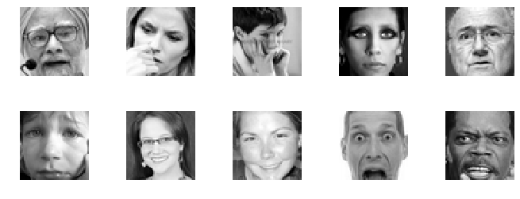
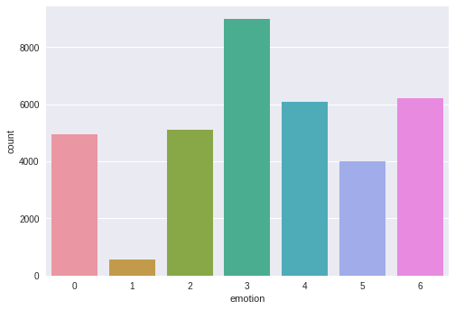
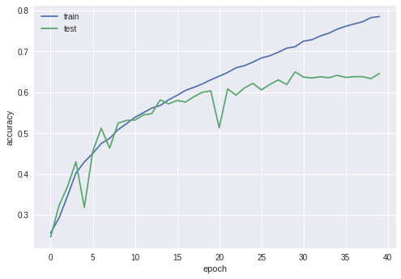
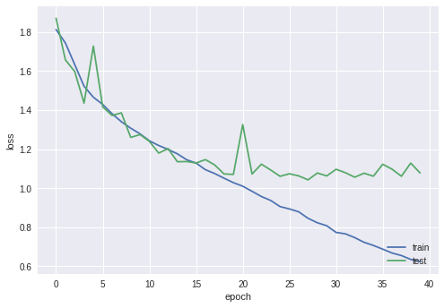

# Emotion-recognition
<p>Real time emotion recognition with Keras CNN and OpenCv. Keras is used to train the emotion classification model on face and OpenCv to make simple face detection using Haarcascade classifier.

Model has been trained using google colab : https://colab.research.google.com/, it's a cloud service which provides free GPU
</p>

<h2>Dependencies</h2>

<ul>  
  <li>Keras</li>
  <li>Seaborn</li>
  <li>Sklearn</li>
  <li>OpenCv</li>
</ul>

<p>
  Install dependencies :

  ```
  pip install -r requirements.txt
  ```

</p>
<p>
	<h2>Dataset description </h2>
  
  The model has been trained using <a href="https://www.kaggle.com/c/challenges-in-representation-learning-facial-expression-recognition-challenge/data">fer2013 dataset </a> which is composed of 35887 samples splited between 7 classes:
  
  <ul> 
    <li>Classe 0 : Angry 4593 images</li>
    <li>Classe 1 : Disgust 547 images</li>
    <li>Classe 2 : Fear 5121 images</li>
    <li>Classe 3 : Happy 6077 images</li>
    <li>Classe 4 : Sad 6077 images</li>
    <li>Classe 5 : Surprise 4002 images</li>
    <li>Classe 6 : Neutral 6198 images</li>
  </ul>
  
  <p float="left">
    
    
  </p>  
  All samples are 48x48 grayscale face images


</p>

<p>
	<h2>Model evaluation</h2>
	<ul>
		<li>Accuracy :64,59 % on validation set </li>
	</ul>
  
  <p float="left">
     
    
  </p>
</p>
